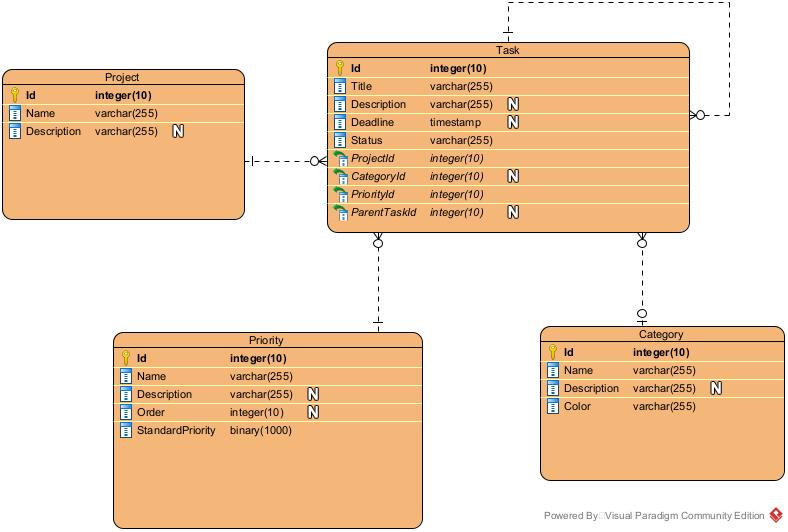

# CheckIt API

een java spring boot 3 api gemaakt voor het vak: Java Backend,
Vives Hogeschool Kortrijk

https://checkit-444817.ew.r.appspot.com/

Door Sam Vanden Berghe
- sam.vanden.berghe@icloud.com (privé)
- sam.vandenberghe@student.vives.be(school)

## Domeinmodel database

Ik heb gekozen voor een postgresql database, deze is gehost op [Supabase](https://supabase.com/)

In de database zitten 4 entiteiten: Project, Category, Priority, Task

### Project (Table/class):
- (PK) id: Int8
- name: varchar (Not null)
- description: varchar

### Category (Table/class):
- (PK) id: Int8
- name: varchar (Not null)
- description: varchar
- color: varchar (Not null)

### Priority (Table/class):
- (PK) id: Int8
- name: varchar (Not null)
- description: varchar
- sequence: int4
- standardpriority: bool

### Task (Table/class):
- (PK) id: Int8
- title: varchar (Not null)
- description: varchar
- deadline: timestamp (Not null)
- status: varchar (Not null)
- (FK)projectid: int8 (Not null)        
  - (foreign key naar table/class Project)
- (FK)categoryid: int8                  
  - (foreign key naar table/class Category)
- (FK)priorityid: int8 (Not null)       
  - (foreign key naar table/class Priority)
- (FK)parenttaskid: int8                
  - (foreign key naar table/class Task)

## relaties Domeinmodel

- Project -1---0< Task                  
  - (een project kan 0 of meer taken hebben, een task moet bij 1 project behoren)
- Category -1|0---0< Task               
  - (een category kan bij 0 of meer taken behoren, een task kan 0 of 1 taak hebben)
- Priority -1---0< Task                 
  - (een priority kan bij 0 of meer taken behoren, een task moet 1 priority hebben)

## Swagger

[CheckIt Swagger](https://checkit-444817.ew.r.appspot.com/swagger-ui/index.html)

## EndPoints

### /

Geen api, simpele 'begin' pagina
- met url naar Swagger-overzicht

### Project

bevat geen volledige crud

- GET /projects
- GET /projects/{id}
- POST /projects/add
- DELETE /projects/delete/{id}

### Category

bevat geen volledige crud

- GET /categories
- GET /categories/{id}
- POST /categories/add
- DELETE /categories/delete/{id}

### Priority

bevat geen volledige crud

- GET /priorities
- GET /priorities/{id}
- GET /priorities/sorted
- PUT /priorities/standard/{id}

### Task

bevat volledige crud

- GET /tasks
- GET /tasks/{id}
- GET /tasks/project/{id}
- GET /tasks/category/{id}
- POST /tasks/add
- PUT /tasks/update/{id}
- DELETE /tasks/delete/{id}

## Profiles

- Active (default): zal verbinding maken met de productiedatabase
- Test: zal verbinding maken met de database die gebruikt wordt voor de testklassen
- Release: zal verbinding maken met de database die gebruikt wordt bij het ontwikkelen

## githubclassroom
